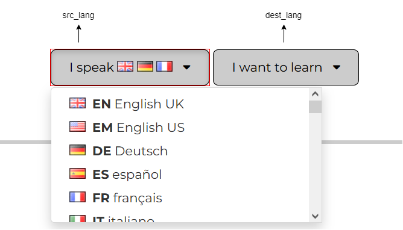

A Python script to extract sentences with and audio and their translations from [50Languages](https://www.50languages.com/)
and generate [Anki](https://apps.ankiweb.net/) flashcards from them for language learning.

## Usage

- Install dependencies: `pip install -r requirements.txt`
- Run the script using something like: `python fiftylangs2anki.py --srclang en --destlang tr --start 5 --end 10`
- You should see a deck package named `50Languages_en-tr_5-10.apkg` in the current working directory.

The `--srclang` and `--destlang` flags take codes of two languages. These are languages you choose in 50Languages's interface
and are shown in the URL of each lesson.



The `--start` and `--end` flags specify the range of lessons to download. By default,
all lessons will be downloaded (from 1 to 100).

The generated Anki notes use a notetype consisting of front-back and back-front card types.
More options to customize this may be added in the future.

### Generating Updated Decks

If you want to generate an updated deck and import it again to Anki,
the notes should have notetypes with the same ID for the deck to be imported without creating duplicates.
This script generate a random notetype ID for each run, which is undesirable in this situation.
The solution is to use the `--model-id` option in the second run, passing it the same ID of the notes
generated in the first run. After importing a deck generated by this script to Anki,
you can find the notetype ID of the notes by running the following code in the [Debug Console](https://docs.ankiweb.net/misc.html#debug-console):
```
pp(mw.col.models.by_name("50Languages_en-tr_1-100")['id'])
```
(Change "50Languages_en-tr_1-100" to the name of your notetype.)

This will give you the ID, which you can pass to the script like:
```
python fiftylangs2anki.py --srclang en --destlang tr --model-id 1409094762
```

## Caching

All materials downloaded from 50Languages are cached under the `cache` directory for re-use in subsequent
invokations of the script that involve the same source or destination language.

## AnkiWeb decks

I plan to upload some decks generated by the script to [AnkiWeb](https://ankiweb.net/shared/decks/).

## Credit

- 50Languages's content is licensed under the Creative Commons Attribution-NonCommercial-NoDerivatives 3.0 license (CC BY-NC-ND 3.0). See https://www.50languages.com/licence.php
